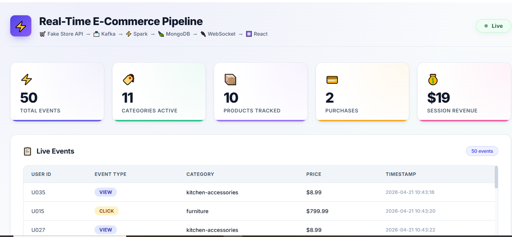

# ⚡ Real-Time E-Commerce Pipeline

A production-ready, real-time analytics dashboard for e-commerce events — built with React, Node.js, Kafka, and MongoDB, deployed on Render.


## 🚀 Live Demo

| Service | URL |
|---|---|
| 🌐 Dashboard | https://ecom-server-2yim.onrender.com |
| 📡 Producer | https://ecom-producer.onrender.com |
| 📥 Consumer | https://ecom-consumer.onrender.com |

## 📊 What It Does

- **Real-time event streaming** — Kafka producer fetches products from DummyJSON API and streams view/click/purchase events every 2 seconds
- **Live dashboard** — React frontend updates in real time via WebSocket
- **MongoDB storage** — Consumer saves events, category stats, and product stats
- **Zero cost** — 100% free tier (Render + MongoDB Atlas + Redpanda)

## 🏗️ Architecture
## 🛠️ Tech Stack

| Layer | Technology |
|---|---|
| Frontend | React, WebSocket |
| Backend | Node.js, Express |
| Message Broker | Apache Kafka (Redpanda Serverless) |
| Database | MongoDB Atlas |
| Producer | Python, confluent-kafka |
| Consumer | Python, confluent-kafka, PyMongo |
| Deployment | Render (Docker) |
| Data Source | DummyJSON API |

## 📁 Project Structure
## ⚙️ Environment Variables

### ecom-server
| Variable | Description |
|---|---|
| `MONGO_URI` | MongoDB Atlas connection string |

### ecom-producer
| Variable | Description |
|---|---|
| `KAFKA_BROKER` | Redpanda bootstrap server URL |
| `KAFKA_USERNAME` | Redpanda SASL username |
| `KAFKA_PASSWORD` | Redpanda SASL password |

### ecom-consumer
| Variable | Description |
|---|---|
| `KAFKA_BROKER` | Redpanda bootstrap server URL |
| `KAFKA_USERNAME` | Redpanda SASL username |
| `KAFKA_PASSWORD` | Redpanda SASL password |
| `MONGO_URI` | MongoDB Atlas connection string |

## 🚀 Deploy Your Own (Free)

1. Fork this repo
2. Set up MongoDB Atlas at cloud.mongodb.com — create free M0 cluster, database user, allow all IPs
3. Set up Redpanda at cloud.redpanda.com — create serverless cluster, topic `product_events`, user with ACL permissions for Topics and Consumer Groups
4. Deploy on Render at render.com — sign up with GitHub, New → Blueprint → select repo → fill env vars → Apply

## 💻 Run Locally

```bash
git clone https://github.com/Akshaya161023/ecom-pipeline.git
cd ecom-pipeline
export MONGO_URI=your_mongo_uri
export KAFKA_BROKER=your_kafka_broker
export KAFKA_USERNAME=your_username
export KAFKA_PASSWORD=your_password
docker-compose up --build
```

## 📈 Dashboard Features

- ⚡ Total Events — live count of all streaming events
- 🏷️ Categories Active — number of active product categories
- 📦 Products Tracked — unique products seen in the stream
- 💳 Purchases — total purchase events
- 💰 Session Revenue — total revenue from purchases
- 📋 Live Events Feed — real-time event table with user, category, price
- 📊 Events by Category — category breakdown chart
- 📉 Live Activity — real-time activity graph

## 👩‍💻 Author

**Akshaya** — [GitHub](https://github.com/Akshaya161023)

## 📄 License

MIT License — feel free to use and modify!
## 📸 Screenshot




